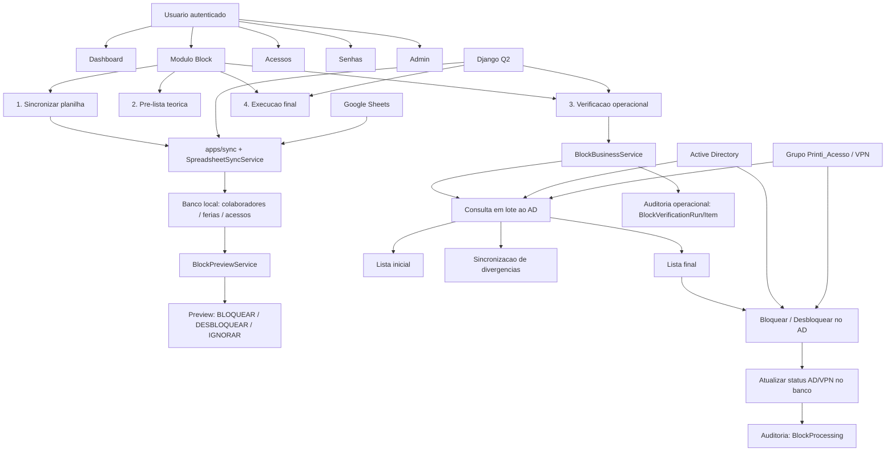

# Documentacao Completa da Aplicacao

## 1. Resumo executivo
O Sistema de Controle de Ferias automatiza um processo que antes era manual e sujeito a esquecimento: bloquear e desbloquear acessos de colaboradores que entram e saem de ferias. O modulo principal e o `block`, que parte dos dados da planilha de ferias, sincroniza essas informacoes no banco, gera uma pre-lista de candidatos, valida essa pre-lista no Active Directory e, por fim, executa apenas as acoes que realmente precisam acontecer.

A aplicacao e de uso operacional interno e pessoal, com administracao centralizada no proprio responsavel pelo processo. Os colaboradores nao operam o sistema, mas sao impactados por ele quando o AD e a VPN sao bloqueados ou liberados conforme o periodo de ferias.

## 2. Visao geral da aplicacao
### Proposito
Automatizar a governanca de acessos durante o ciclo de ferias, reduzindo risco operacional e dependencia de memoria humana.

### Stack e arquitetura
- Backend: Django
- Automacao assíncrona: Django Q2
- Banco de dados: SQLite
- Frontend: Django Templates + HTMX + Tailwind CSS
- Integracoes: Google Sheets/planilha de ferias, Active Directory, VPN via grupo no AD

### Apps do projeto
- `apps/block`: nucleo do produto e principal esteira de bloqueio/desbloqueio
- `apps/sync`: sincronizacao da planilha para o banco
- `apps/dashboard`: visao consolidada do periodo de ferias
- `apps/accesses`: monitoramento dos acessos por colaborador e por sistema
- `apps/passwords`: compartilhamento seguro de senhas e links temporarios
- `apps/people`: modelos legados/operacionais de colaboradores, ferias, acessos e logs
- `apps/core`: configuracoes globais da aplicacao
- `apps/scheduler`: remanescente de transicao; o orquestrador atual de automacao e o Django Q2

## 3. Personas e usuarios
### Persona primaria: Administrador operador
- Quem e: responsavel unico pela operacao
- Objetivo: garantir que os acessos sejam bloqueados e desbloqueados automaticamente no timing correto
- Dor atual resolvida: esquecer de bloquear ou liberar manualmente quando alguem entra ou volta de ferias
- Necessidades: confianca no fluxo, visibilidade do que sera executado, logs claros e controle manual quando necessario

### Usuario indireto: Colaborador em ferias
- Quem e: colaborador que entra ou sai de ferias
- Papel no sistema: nao opera a aplicacao
- Impacto: tem o AD bloqueado ao sair e liberado ao retornar, com reflexo na VPN

### Usuario secundario futuro: Equipe interna
- Quem e: pessoas da equipe que podem acessar o sistema
- Papel: consulta normal
- Restricao desejada: botao/area administrativa visivel apenas para usuarios administradores

## 4. Mapa de navegacao
### Navegacao principal autenticada
- `Dashboard`
- `Acessos`
- `Senhas`
- `Block`
- `Admin`

### Mapa por area
- `/dashboard/`
  - resumo do periodo
  - sincronizacao manual da planilha
  - filtros por periodo, status e retorno
- `/accesses/`
  - visao consolidada de acessos por colaborador
  - filtros por sistema, gestor, status e situacao
- `/passwords/`
  - criacao de link seguro
  - historico de links
  - busca de colaborador
- `/block/`
  - sincronizar planilha
  - pre-visualizar fila
  - rodar verificacao operacional
  - executar block
  - testar bloqueio
  - testar desbloqueio
  - consultar historico e fila final
- `/admin/`
  - configuracoes operacionais
  - configuracoes do block
  - cadastros e auditoria

## 5. Fluxo principal do usuario
### Fluxo operacional principal
1. Baixar/sincronizar a planilha de ferias para o banco.
2. Gerar a pre-lista de candidatos a bloqueio e desbloqueio.
3. Rodar a verificacao operacional do block.
4. Consultar o AD para validar a pre-lista.
5. Gerar a lista final com apenas quem realmente precisa de acao.
6. Rodar a task final de bloqueio e desbloqueio.
7. Registrar log de tudo que foi executado, ignorado, sincronizado ou que falhou.

### Logica em camadas no modulo `block`
1. `Preview`: olha apenas banco + historico e monta a fila teorica.
2. `Verificacao operacional`: consulta AD em lote, sincroniza divergencias e reduz a fila.
3. `Execucao final`: consome a fila final e faz bloqueio/desbloqueio real.

## 6. Fluxos alternativos
### Fluxo alternativo 1: usuario ja esta no estado correto
1. A pre-lista indica bloqueio ou desbloqueio.
2. A verificacao operacional consulta o AD.
3. O AD mostra que o usuario ja esta correto.
4. O sistema nao executa acao real.
5. O banco local e sincronizado e o item sai da fila final.

### Fluxo alternativo 2: execucao ja realizada hoje
1. O sistema detecta um `SUCESSO` do mesmo tipo no mesmo dia.
2. O usuario nao e reenviado para execucao real.
3. O item entra como ignorado ou removido da fila com motivo explicito.

### Fluxo alternativo 3: falha na consulta ao AD
1. A verificacao operacional nao consegue confirmar o estado real.
2. O item nao segue para execucao final.
3. O erro e registrado para revisao.

### Fluxo alternativo 4: operacao manual controlada
1. O operador usa os botoes do modulo `block`.
2. Pode sincronizar, validar e executar em etapas.
3. O fluxo continua auditavel mesmo quando nao depende apenas da automacao.

## 7. Modulos e funcionalidades
### Modulo `block` - principal
- Gera pre-visualizacao da fila teorica
- Executa verificacao operacional em lote
- Gera lista inicial e lista final
- Sincroniza status locais com o AD quando encontra divergencia
- Executa bloqueio e desbloqueio real
- Mantem historico de execucao
- Permite testes com usuario tecnico configurado

### Modulo `sync`
- Baixa planilha do Google Sheets
- Processa abas e datas de ferias
- Resolve colaborador por email, login AD ou nome
- Atualiza `ferias` e `acessos`
- Gera CSV de pendencias quando nao encontra colaborador
- Registra logs de sincronizacao

### Modulo `dashboard`
- Mostra metricas do periodo
- Destaca quem esta em ferias, retornou ou vai retornar
- Exibe ultima sincronizacao
- Oferece disparo manual da sync

### Modulo `accesses`
- Consolida acessos por colaborador
- Mostra situacao operacional
- Ajuda a identificar pendencias apos retorno ou durante ferias

### Modulo `passwords`
- Cria links seguros temporarios
- Mantem historico de compartilhamentos
- Apoia operacao interna de acessos sensiveis

### Modulo `core/admin`
- Mantem configuracoes operacionais
- Controla auto start do scheduler junto com o servidor
- Permite reinicio da aplicacao web

## 8. Regras de negocio
### Regras centrais
- Se o colaborador esta saindo de ferias, ele deve ser bloqueado.
- Se o colaborador esta retornando de ferias, ele deve ser desbloqueado.
- Se o sistema nao rodou exatamente no dia, ele ainda deve corrigir o atraso:
  - em ferias e nao bloqueado -> bloquear
  - retornou e ainda bloqueado -> desbloquear

### Regras de verificacao operacional
- A pre-lista vem do banco e do calendario de ferias.
- A verificacao operacional consulta o AD antes da execucao final.
- Se o AD ja estiver no estado correto, o sistema nao executa a acao real.
- Quando houver divergencia entre banco e AD, o banco deve ser sincronizado.
- A lista final da verificacao operacional e a base da proxima task de execucao final.

### Regras de VPN
- A VPN depende do grupo `Printi_Acesso` no AD.
- No bloqueio:
  - se o usuario esta no grupo, registrar VPN como bloqueada
  - se nao esta no grupo, registrar `NP`
- No desbloqueio:
  - liberar o AD
  - manter a regra de VPN preparada para evolucao futura

### Regras de duplicidade
- Se ja houve `BLOQUEIO` com sucesso hoje, nao bloquear novamente.
- Se ja houve `DESBLOQUEIO` com sucesso hoje, nao desbloquear novamente.
- Se houve erro, pode tentar novamente.

### Regras de permissao
- A aplicacao pode ser acessada pela equipe.
- A administracao sensivel deve ficar restrita a usuarios administradores.
- O botao/entrada de admin deve aparecer apenas para administradores.

## 9. Requisitos funcionais
- RF01: o sistema deve baixar e processar a planilha de ferias.
- RF02: o sistema deve persistir colaboradores, eventos de ferias e acessos no banco.
- RF03: o sistema deve gerar uma pre-lista teorica de bloqueio e desbloqueio.
- RF04: o sistema deve consultar o AD para validar a pre-lista antes da execucao final.
- RF05: o sistema deve gerar uma lista final de usuarios que realmente exigem acao.
- RF06: o sistema deve sincronizar o banco quando o AD ja estiver no estado correto.
- RF07: o sistema deve executar bloqueio real no AD para usuarios em ferias que continuam liberados.
- RF08: o sistema deve executar desbloqueio real no AD para usuarios que retornaram e ainda estao bloqueados.
- RF09: o sistema deve refletir o impacto da regra de VPN com base no grupo do AD.
- RF10: o sistema deve registrar auditoria de cada processamento real.
- RF11: o sistema deve registrar auditoria da verificacao operacional, incluindo lista inicial, lista final e motivo por item.
- RF12: o sistema deve permitir execucao manual das etapas pelo frontend.
- RF13: o sistema deve suportar execucao automatizada via Django Q2.
- RF14: o sistema deve disponibilizar ambiente de teste com usuario tecnico configuravel.

## 10. Requisitos nao funcionais
- RNF01: o sistema deve reduzir a dependencia de operacao manual.
- RNF02: o sistema deve ser auditavel, com rastreabilidade por usuario e por acao.
- RNF03: o sistema deve evitar execucoes duplicadas no mesmo dia.
- RNF04: o sistema deve tolerar falhas de rede/AD sem perder o contexto operacional.
- RNF05: a verificacao operacional deve priorizar consulta em lote para reduzir overhead.
- RNF06: a interface deve permitir compreensao rapida da fila e do historico.
- RNF07: configuracoes sensiveis devem ficar protegidas por permissao administrativa.
- RNF08: a automacao deve ser gerenciavel sem dependencia de terminal manual.

## 11. User stories
- Como administrador, quero sincronizar a planilha de ferias para manter o banco atualizado.
- Como administrador, quero ver uma pre-lista antes da execucao para entender o que o sistema pretende fazer.
- Como administrador, quero rodar uma verificacao operacional para validar no AD o estado real dos usuarios.
- Como administrador, quero que usuarios ja corretos no AD sejam apenas sincronizados no banco, sem nova acao real.
- Como administrador, quero uma lista final confiavel para executar apenas o que ainda falta.
- Como administrador, quero bloquear automaticamente quem entrou em ferias.
- Como administrador, quero desbloquear automaticamente quem voltou de ferias.
- Como administrador, quero impedir que a mesma acao rode duas vezes com sucesso no mesmo dia.
- Como administrador, quero consultar logs claros para entender por que um usuario foi executado, ignorado, sincronizado ou falhou.
- Como membro da equipe, quero acessar a aplicacao normal sem ver controles administrativos sensiveis.

## 12. Organograma da aplicacao em Mermaid

## 13. Proximos passos
- Restringir visualmente o botao `Admin` apenas a usuarios administradores, alinhando interface com a regra desejada.
- Consolidar a documentacao tecnica existente para separar claramente:
  - fluxo atual em producao
  - componentes legados/em transicao
  - backlog futuro
- Evoluir a task final para consumo ainda mais explicito da fila operacional validada.
- Criar uma tela de detalhes historicos por execucao operacional, com filtros por usuario, motivo e data.
- Revisar a experiencia de administracao para abrir acoes sensiveis em modal quando fizer sentido.
- Expandir observabilidade com metricas de sucesso, tempo medio de ciclo e taxa de sincronizacao sem acao real.
